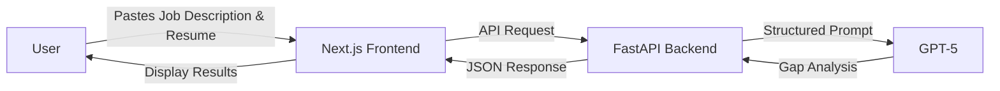

# 🎯 ATS Nexus: Precision Resume Optimizer

> Bridging the gap between your experience and the recruiter's desk.

<p align="center">
  
  
  
  
</p>

---

## 🚨 The Problem

**75% of resumes never reach human eyes.**

Modern companies use Applicant Tracking Systems (ATS) to automatically filter thousands of applications. Even qualified candidates get rejected because their resumes don't match the exact keywords, format, or structure the ATS is looking for.

**The result?** Talented professionals miss opportunities because of automated gatekeepers.

---

## 💡 The Solution

**ATS Nexus** is an AI-powered resume optimizer that performs intelligent gap analysis between job descriptions and resumes. Using GPT-5, it provides:

- 📊 **Match Score** out of 100
- 🔑 **Top 3 Missing Keywords** for ATS optimization
- ✍️ **2 Specific Bullet Point Improvements** to strengthen your resume
- 📝 **Executive Summary** analyzing overall compatibility, your biggest strength, and the key area to focus on

Think of it as having a senior technical recruiter review your application *before* you submit it.

---

## 🏆 AI Engineer Challenge: Mission Accomplished

This project demonstrates three core competencies for AI Engineers:

### 1️⃣ **LLM Orchestration**
- Built a FastAPI backend that intelligently routes requests to OpenAI's GPT-5
- Structured prompt engineering for consistent, actionable feedback
- Error handling and response parsing for production-ready deployment

### 2️⃣ **Advanced Prompt Engineering**
- **Developer Role (System Prompt):** Configured GPT-5 to act as an "expert technical recruiter"
- **Structured Output:** Engineered prompts to return match scores, keywords, improvements, and executive summary
- **Multi-part Analysis:** Four-section response format for comprehensive feedback
- **Context Window Optimization:** Efficiently combines job descriptions and resumes in a single request

### 3️⃣ **Full-Stack LLM Deployment**
- **Frontend:** Professional Next.js UI with Tailwind CSS and Framer Motion
- **Backend:** Python FastAPI with OpenAI SDK integration
- **Deployment:** Hybrid architecture on Vercel (Next.js + Python serverless functions)
- **Production Features:** Environment variable management, CORS configuration, error handling

---

## 🛠️ Tech Stack

| Layer | Technology | Purpose |
|-------|-----------|---------|
| **Frontend** | Next.js 14.2 + TypeScript | Server-side rendering, React components |
| **Styling** | Tailwind CSS | Professional dark mode UI with glassmorphism |
| **Animation** | Framer Motion | Smooth transitions and micro-interactions |
| **Backend** | FastAPI | High-performance Python API framework |
| **AI** | OpenAI GPT-5 | Natural language understanding and generation |
| **Deployment** | Vercel | Serverless deployment with auto-scaling |

---

## 🚀 Quick Start

### Prerequisites

- Python 3.9+ (managed by `uv`)
- Node.js 18+ and npm
- OpenAI API key ([Get one here](https://platform.openai.com/api-keys))

### 1. Clone the Repository

```bash
git clone https://github.com/YOUR_USERNAME/The-AI-Engineer-Challenge.git
cd The-AI-Engineer-Challenge
```

### 2. Set Up the Backend

```bash
# Install uv package manager
pip install uv

# Install Python dependencies
uv sync

# Set your OpenAI API key
export OPENAI_API_KEY=sk-your-key-here

# Start the FastAPI server
uv run uvicorn api.index:app --reload
```

The API will be available at `http://localhost:8000`

### 3. Set Up the Frontend

```bash
# Install Node dependencies
npm install

# Start the Next.js dev server
npm run dev
```

The app will be available at `http://localhost:3000`

### 4. Environment Variables

Create a `.env` file in the root directory:

```env
OPENAI_API_KEY=sk-your-openai-api-key
```

---

## 📁 Project Structure

```
ATS-Nexus/
├── api/                    # FastAPI backend
│   ├── index.py           # Main API routes and GPT-5 integration
│   └── requirements.txt   # Python dependencies
├── app/                    # Next.js frontend
│   ├── page.tsx           # Main application page
│   ├── layout.tsx         # Root layout component
│   └── globals.css        # Global styles
├── vercel.json            # Vercel deployment configuration
└── package.json           # Node.js dependencies
```

---

## 🎨 Features

### Professional UI/UX
- **Dark Mode Design:** Deep slate background with emerald/blue accents
- **Glassmorphism:** Subtle backdrop blur and transparency effects
- **Responsive Layout:** Optimized for desktop and mobile
- **3-Step Visual Guide:** Clear instructions for users

### Smart Analysis
- **Real-time Processing:** Instant feedback on resume-job match
- **Comprehensive Feedback:** Match score, keywords, improvements, and executive summary
- **Actionable Insights:** Clear guidance on what to improve and why
- **Error Handling:** User-friendly error messages with troubleshooting tips

### Production Ready
- **Serverless Architecture:** Auto-scaling on Vercel
- **CORS Configuration:** Secure frontend-backend communication
- **Environment Management:** Safe API key handling

---

## 🌐 Deployment

### Deploy to Vercel

1. Push your code to GitHub
2. Connect your repo to Vercel
3. Add environment variables:
   - `OPENAI_API_KEY`: Your OpenAI API key
4. Deploy!

Vercel will automatically:
- Build the Next.js frontend
- Deploy Python API as serverless functions
- Configure routing between frontend and backend

---

## 📊 How It Works



1. **User Input:** Job description and resume text
2. **API Processing:** FastAPI constructs a specialized prompt
3. **AI Analysis:** GPT-5 evaluates match and identifies gaps
4. **Structured Output:** Match score, keywords, improvements, and executive summary
5. **Visual Display:** Results shown in professional UI with clear section headers

---

## 🎓 Learning Outcomes

Building ATS Nexus teaches:

- **LLM Integration:** Working with OpenAI's API
- **Prompt Engineering:** Crafting effective system prompts
- **Full-Stack Development:** Next.js + FastAPI hybrid architecture
- **Serverless Deployment:** Managing environment variables and routing
- **Production Best Practices:** Error handling, CORS, and security

---

## 🤝 Contributing

This project was built as part of the AI Makerspace Engineer Challenge. Feel free to fork it and make it your own!

---

## 📝 License

MIT License - feel free to use this project for learning and portfolio purposes.

---

## 🙏 Acknowledgments

- **AI Makerspace** for the challenge framework
- **OpenAI** for GPT-5 API access
- **Vercel** for seamless deployment platform

---

**Ready to optimize your resume?** [Try ATS Nexus Now →] https://ats-nexus-risheeks-projects-79f72a64.vercel.app/
